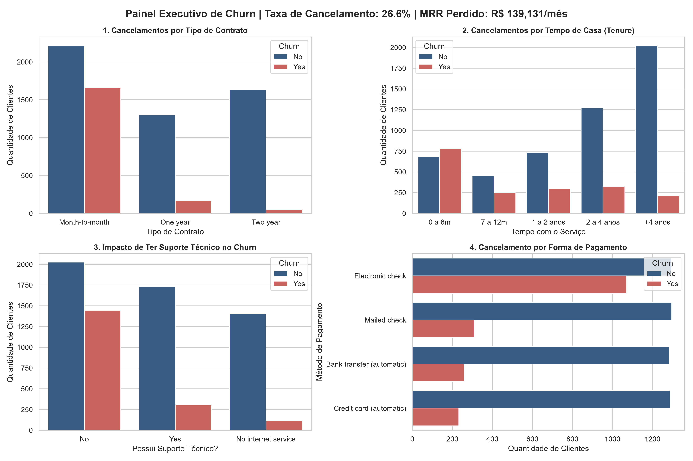

# 📊 Análise de Churn de Clientes com Python

Este projeto analisa os fatores que levam clientes ao cancelamento de serviço (*churn*) em uma empresa de telecomunicações, identificando gargalos operacionais e oportunidades de retenção de receita recorrente (MRR).

---

## 📈 Painel de Resultados



---

## Principais Indicadores (KPIs)
- **Total de Clientes:** 7.032
- **Taxa Geral de Churn:** 26.58%
- **Receita Mensal Perdida (MRR):** ~R$ 139.130,00 / mês
- **Ticket Médio:** R$ 64.80 / cliente

---

## Insights Encontrados
1. **Período de Risco (0 a 6 meses):** A maior concentração de cancelamentos ocorre nos primeiros meses de assinatura, apontando necessidade de melhorar o processo de boas-vindas (*onboarding*).
2. **Tipo de Contrato:** Clientes com contrato mensal (*Month-to-month*) têm propensão ao cancelamento mais de 4x superior aos clientes com contratos de 1 ou 2 anos.
3. **Serviços de Suporte:** Clientes que não utilizam o serviço de **Suporte Técnico** cancelam com frequência muito maior do que os clientes assistidos.
4. **Forma de Pagamento:** Clientes que pagam via *Electronic Check* (cheque eletrônico/boleto manual) concentram a maioria dos cancelamentos.

---

## Plano de Ação Recomendado
1. **Campanha de Onboarding:** Acompanhamento proativo de novos clientes nos primeiros 90 dias.
2. **Incentivo a Planos Anuais:** Descontos progressivos na mensalidade para migração de planos mensais para planos de fidelidade.
3. **Pacote de Suporte Gratuito:** Oferta de 3 meses gratuitos de suporte técnico para novos assinantes.

---

## Tecnologias Utilizadas
- **Linguagem:** Python
- **Manipulação de Dados:** Pandas
- **Visualização de Dados:** Matplotlib & Seaborn

---

## Como Executar
```bash
# 1. Instalar dependências
pip install pandas matplotlib seaborn

# 2. Rodar a análise
python analise_churn.py
